# sched.md

---

## Context Switch

A continuacion mostramos el procedimiento de cambio de contexto por medio de GDB, pasando de kernel a un proceso de usuario.

- Se inicia añadiendo el breakpoint a la función env_run, y a continuacion se ejecutan las lineas hasta encontrarse previo a la ejecución del context switch:

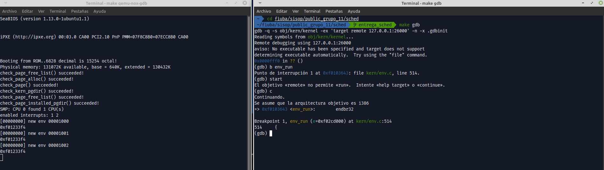

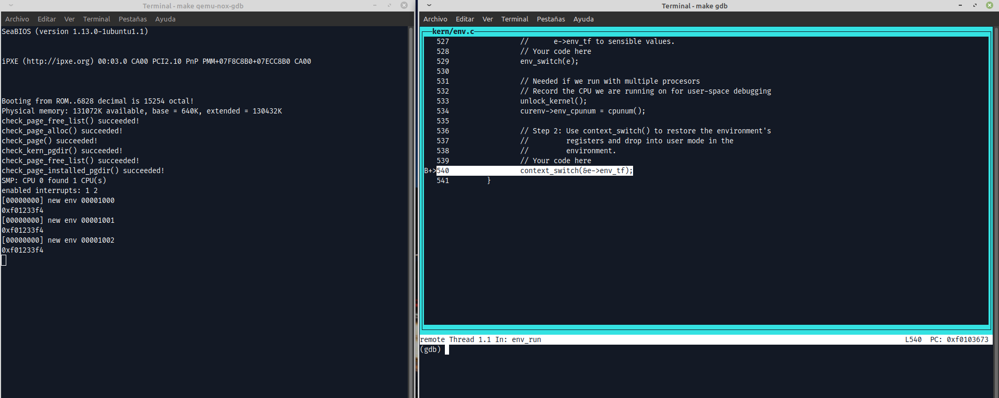

- Luego entramos a la ejecución de context swith con un stepi:

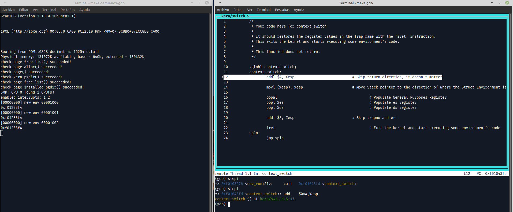

- Revisamos los valores de los registros actualmente:

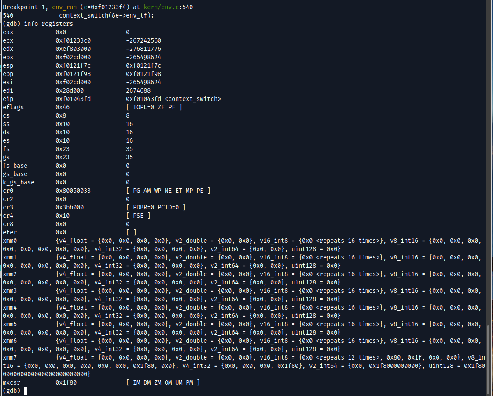

- De los anteriores se pueden destacar los valores de:
  - `esp`: Actualmente con la direccion de retorno que va a ser posteriormente skippeada
  - `eip`: Con la direccion actual de inicio de codigo del context switch
  - `cs:` Con valor `0x8` == `1000 (binario)` ; De donde con los ultimos dos bits se determina que actualmente nos encontramos en Ring 0.

- Ahora vemos el estado que tiene el stack pointer:

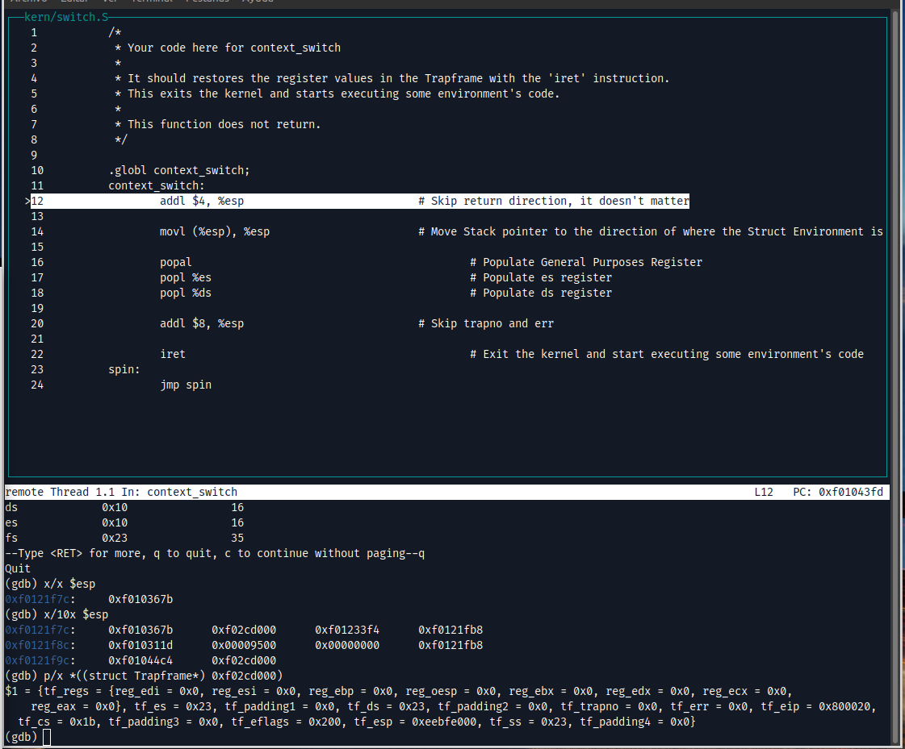

- Tambien observamos que el struct Trapframe se corresponde a los valores vistos almacenados en el stack como parametro para el context switch:

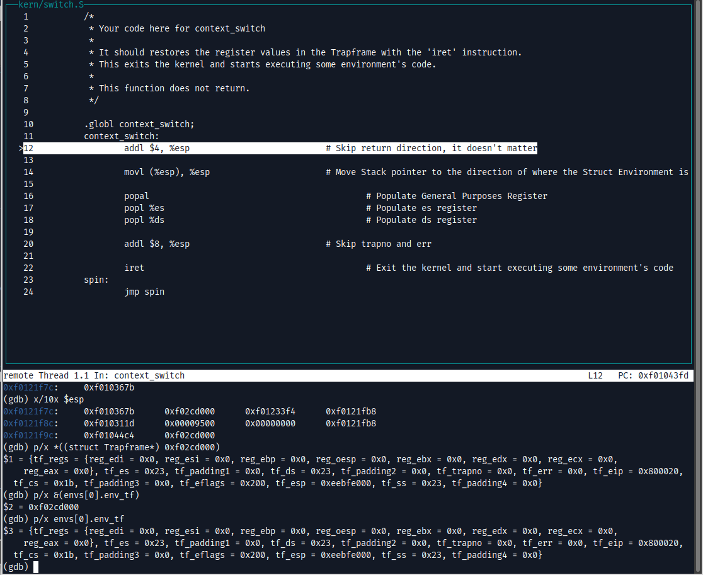

- Observamos ahora el estado del `esp` tras saltear la direccion de retorno y tras cargar el contenido del struct Trapframe a partir de su puntero:

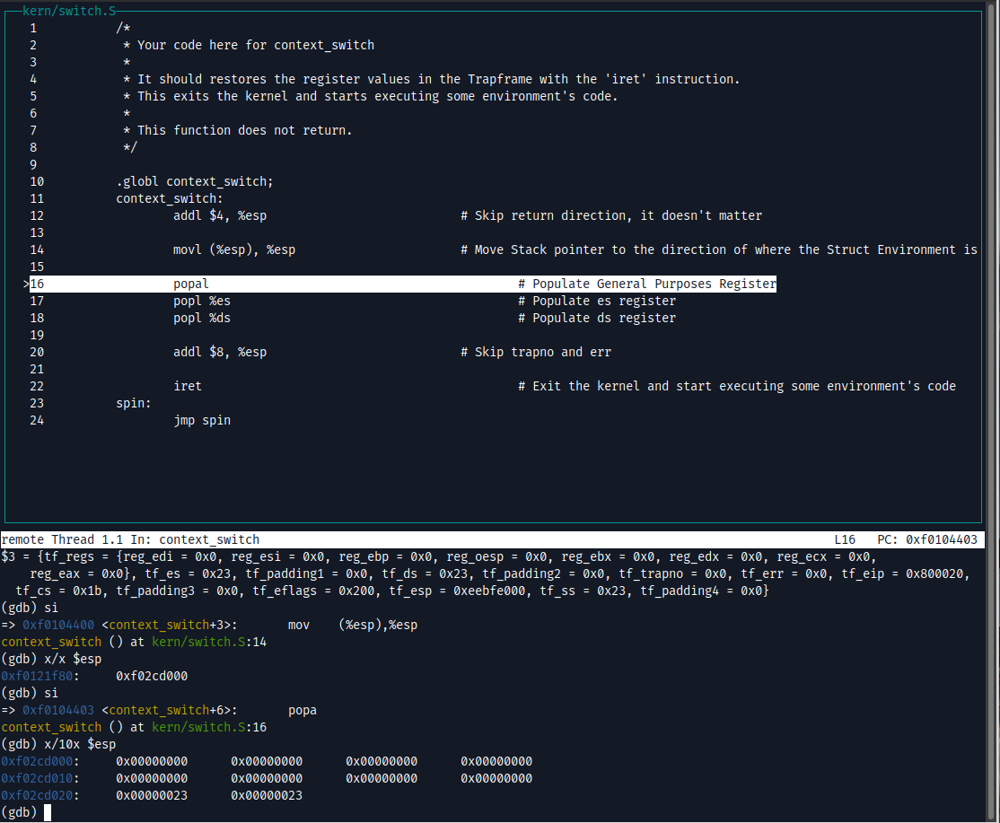

- Posteriormente se cargan los registros de proposito general y los registros `es` y `ds`

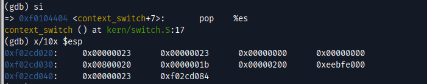

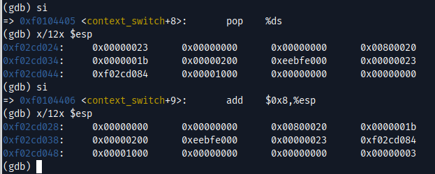

- Se aumenta en 8 el `esp` para saltear los valores trapno y err:

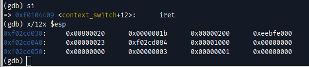

- Se procede a ejecutar `iret`:

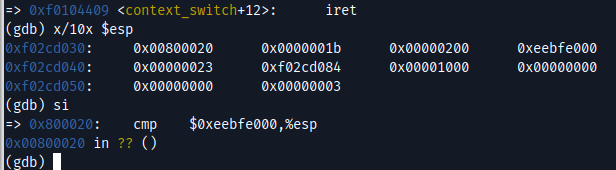

- Y ahora se observan los registros tras la ejecución. Notar que ahora estamos en el proceso de usuario. Notar que el valor del registro `cs` cambió a `0x1b` == `0001 1011 (bin)`; de donde los ultimos 2 bits representan que nos encontramos en Ring 3:

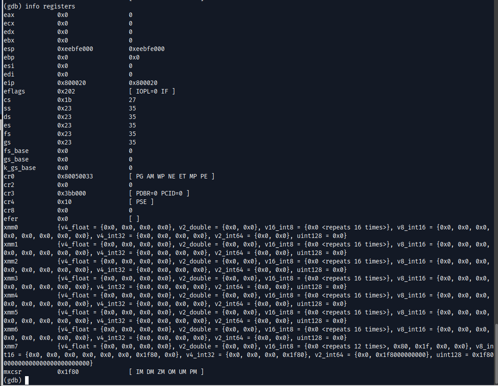

---

## Scheduler

### MLFQ

Para el scheduler con prioridades se decidio implementar MLFQ. Para esto se realizaron ciertos cambios en la estructuras del _environment_ y el comportamiento del `lAPIC`.

```c
struct Env {
	(...)
	int32_t queue_num;
	struct Env *next_env;
	int32_t time_remaining;
	int32_t time_in_queue;
};
```
Para el facil armado y manejo de la estructuras de las colas, cada _environment_ tiene un puntero a su proximo _environment_ dentro de la cola. 

`queue_num` refiere a la cola en la que se encuentra actualmente el _environment_. A menor numero de cola, mayor prioridad. (En otras palabras, la cola 0 es la que tiene mas prioridad)

`time_remaining` es el tiempo que le queda al environment para correr.

__local APIC timer__

Se modifico el comportamiento, pasandolo de _periodic mode_, a _one-shot mode_, permitiendo un control del tiempo mas granular para cada _environment_ que se vaya a correr.

Las variables que se utilizan para 'tunear' los tiempos de esta implementacion de MLFQ se encuentran en `inc/sched.h`.

- `NQUEUES` : Cantidad de colas dentro de MLFQ
- `MLFQ_BOOST_AMNT` : Cantidad de veces que se debe terminar el equivalente a un _time slice_ para realizar el boost de todos los _environments_ a la cola de mayor prioridad
- `MLFQ_BASE_TIMER` : Tiempo base de un _time slice_. El tiempo final puede ser, o no, modificado por la prioridad del _environment_ a correr.
- `MLFQ_MIN_THRESHOLD` : Cantidad de tiempo minimo para que un _environment_ pueda correrse. Se toma para que luego del _context switch_ el proceso pueda realizar acciones. 
- `MLFQ_MAX_TIME_IN_QUEUE` : Cantidad de tiempo hasta que un _environment_ baje de prioridad.
- `CPU_TIME_HALT` : Tiempo para que una CPU se despierte desde `CPU_HALTED` para ver si tiene algo para correr. 
---
